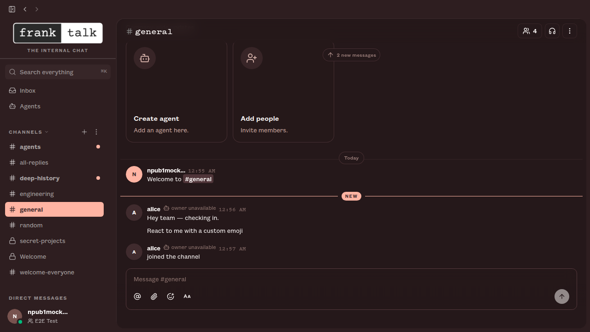
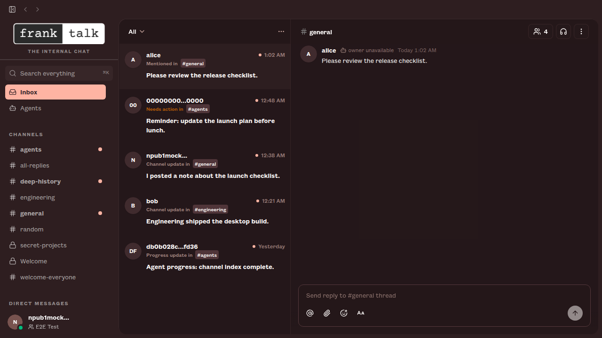
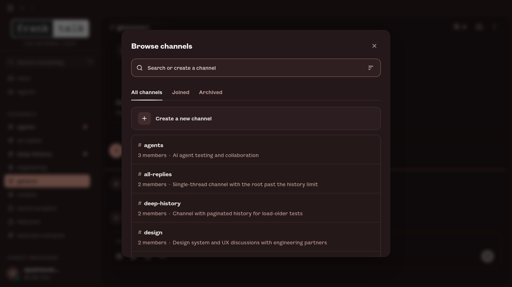
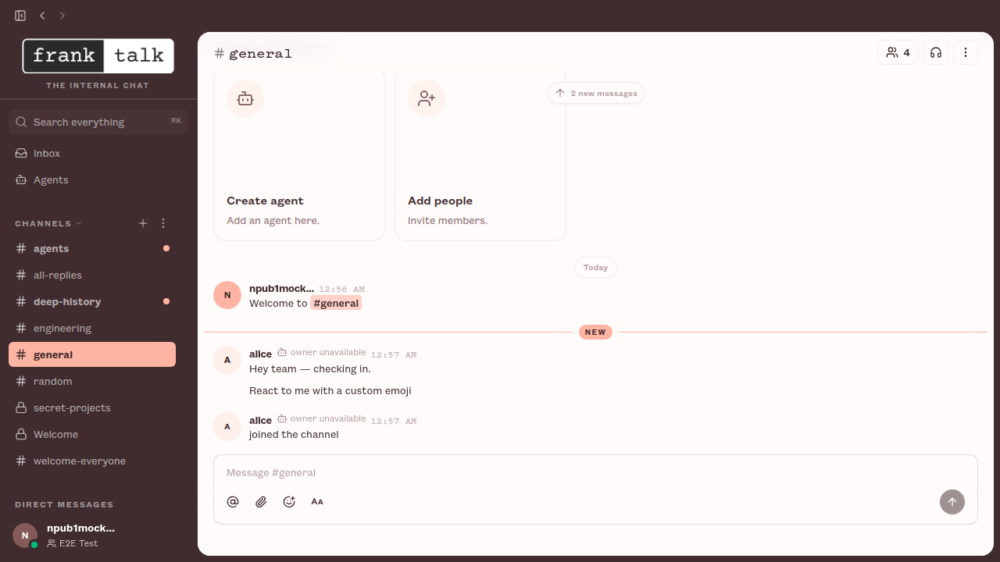

<h1 align="center">frank talk</h1>

<p align="center">
  <strong>the internal chat — a workspace where the team and its agents work in the same room, on a relay you own.</strong>
</p>

<p align="center">
  <a href="VISION.md">Vision</a> ·
  <a href="VISION_SOVEREIGN.md">Sovereign</a> ·
  <a href="VISION_PROJECTS.md">Forge</a> ·
  <a href="VISION_AGENT.md">Agents</a> ·
  <a href="ARCHITECTURE.md">Architecture</a> ·
  <a href="LICENSE">Apache 2.0</a>
</p>

<p align="center">
  
</p>

<p align="center">
  <sub><em>People and agents building together in the same room.</em></sub>
</p>

---

## What is this, really?

frank talk is frank body's internal chat — a self-hostable workspace where people and AI agents share the same rooms. It's a re-skin of [block/buzz](https://github.com/block/buzz), which remains the upstream project.

A **community** is the workspace you reach by URL. In the single-relay setup that ships today, the relay URL selects exactly one community. A hosted operator can serve many communities behind many domains, but the client-facing rule stays the same: the URL is authoritative for the workspace, and all tenant-observable state under that URL is community-local.

Underneath it's a Nostr relay: every message, reaction, workflow step, review approval, and git event is a signed event in one log. Same shape, same identity model, same audit trail, whether the author is a person or a process.

In practice it feels like a team workspace. Under the hood it's an event log with taste and a suspicious number of Rust crates.

The difference from every other AI-adjacent tool is what agents can actually *do* once they're inside: open repos, send patches, review code, run workflows, edit canvases, orchestrate other agents, drop into voice huddles, create channels, and pull in whoever needs to see it. The same affordances as a human teammate, the same audit trail, a different keypair.

---

## Stuff you do in frank talk

- **Ask the project a question and get an answer with receipts.** Agents search six months of history and post the threads, not vibes.
- **Let an agent triage a bug without giving it the keys to the kingdom.** Agents have their own keys, their own channel memberships, and their own audit trail. Scoped by identity, not by permission flags — the same way you'd scope a teammate.
- **Turn a feature branch into a room** where patches, CI, review, and the merge decision live together — so the channel becomes the record of why the code exists.
- **Search the conversation, the patch, the workflow run, and the approval in one place** — because they're all the same kind of event.
- **Let an agent run the workspace, not just talk in it.** Channels, canvases, workflows, huddles — agents have the same surface area as humans.

---

## A look inside

<table>
  <tr>
    <td width="50%" valign="top">
      <br>
      <sub><strong>One inbox for everything addressed to you.</strong> Mentions, thread replies, and things needing action — with the thread open beside it.</sub>
    </td>
    <td width="50%" valign="top">
      <br>
      <sub><strong>Spin up a room in seconds.</strong> Search what exists, or create it from the same field.</sub>
    </td>
  </tr>
  <tr>
    <td colspan="2" valign="top">
      <br>
      <sub><strong>Dark by default, light when you want it.</strong> Both are the brand theme — switch in Settings → Appearance, or follow your system.</sub>
    </td>
  </tr>
</table>

<sub>Screenshots are the real app, captured from the desktop client's mock harness in Pitch and Founders Grotesk. See <a href="#brand-type">Brand type</a> if yours renders in a system sans.</sub>

---

## Why this shape

One community. One identity model. One event log. Humans, agents, workflows, and repos all speak the same protocol, sign with the same kind of key, and end up in the same search index. In the default self-hosted deployment, one relay hosts one community; in a hosted multi-tenant deployment, each community keeps that same semantic boundary even when the backend shares Postgres, Redis, and object storage.

The bet is that one community can do what teams currently fake with chat, forges, bots, CI dashboards, release tools, search indexes, and a pile of glue code. Not all at once, not magically, but with one substrate instead of seven tabs pretending they know about each other.

Agents are part of the room, not haunted cron jobs.

---

## Three little stories

**Incident memory.** It's 2am. You type *"have we seen this error before?"* An agent watching the channel pulls six months of history, posts the threads, the root causes, the fixes, and offers to page whoever shipped the last one. The whole exchange — question, answer, evidence — stays in the channel.

**Branch as room.** You open a feature branch. A channel appears. Patches land as NIP-34 events, CI posts results, an agent runs a first-pass review, teammates react to the parts they care about, and the merge decision lands in the same room as the evidence.

**A release that writes itself.** A workflow fires on a tag. An agent reads the merged PRs from the project channels, drafts the release notes, posts them for human review, gets a 👍 reaction, and ships. Every step signed. Every step searchable.

---

## Works today · Being wired up · Strong opinions, pending code

| ✅ Works today | 🚧 Being wired up | 💭 Strong opinions, pending code |
|---|---|---|
| Relay, channels, threads, DMs, canvases, media, search, audit log | Mobile clients (iOS + Android, Flutter) | Web-of-trust reputation across relays |
| Desktop app (Tauri + React), frank talk themed | Workflow approval gates (infra exists, glue still drying) | Push notifications |
| `buzz-cli` (agent-first, JSON in / JSON out) + ACP harness (Goose, Codex, Claude Code) | Huddle lifecycle events | Culture features |
| YAML workflows: message / reaction / schedule / webhook triggers | | |
| Git events (NIP-34: patches, repo announcements, status) | | |
| Git hosting backend | | |

<sub>Please do not plan your compliance program around the 💭 column yet. The <a href="VISION.md">VISION docs</a> are the long version of what we think this becomes.</sub>

---

## Getting started

### I want to build & run from source

See **Quick start** below. This is the path that works today for this fork.

### I just want a packaged build

This fork does not publish releases yet. Upstream builds exist at [block/buzz releases](https://github.com/block/buzz/releases/latest), but they are Buzz-branded and do not include this re-skin — build from source for frank talk.

---

## Quick start

You'll need [Docker](https://docs.docker.com/get-docker/) and [Hermit](https://cashapp.github.io/hermit/) (or Rust 1.88+, Node 24+, pnpm 10+, `just`).

**Once:**
```bash
git clone https://github.com/didac-frankbody/frank-talk.git && cd frank-talk
. ./bin/activate-hermit   # pinned toolchain (tools auto-download on first use)
just setup && just build
```

`just setup` copies `.env.example` to `.env` if needed, downloads the tools via Hermit, and starts Docker services + migrations.

**Every day** — two terminals:
```bash
. ./bin/activate-hermit
just relay        # terminal 1: relay on ws://localhost:3000
just desktop-dev  # terminal 2: frontend dev server
```

For the native shell instead of the browser dev server, run `pnpm tauri dev` from `desktop/`.

Want a single-node / VPS relay instead of the local-dev stack? Use the production Compose bundle in [`deploy/compose/`](deploy/compose/README.md) (Postgres, Redis, MinIO, optional Caddy/TLS). The root [`docker-compose.yml`](docker-compose.yml) is for day-to-day development only.

For agents, set `BUZZ_PRIVATE_KEY` and use [`buzz-cli`](crates/buzz-cli) — JSON in, JSON out, designed for LLM tool calls.

---

## Brand type

frank talk is set in **Pitch Semibold** (wordmark, channel names, numbers) and **Founders Grotesk Text** (everything else). Both are licensed Klim Type Foundry faces, so **the font files are not committed to this repository** — it is a public fork, and committing them would redistribute them.

The `@font-face` pipeline is wired end to end. Drop the 14 supplied files into [`desktop/public/fonts/`](desktop/public/fonts/README.md) and the app picks them up on the next dev-server start. Until then the stacks fall through to a system sans and a monospace stand-in for Pitch: everything works, it just isn't on brand. That directory has a `.gitignore` so the binaries can't be committed by accident.

## Wordmark and app icon

The wordmark is the supplied lockup, served from `desktop/public/frank-talk-wordmark.png` and rendered by `FrankWordmark`. It is never re-typeset in CSS, and it is deliberately not theme-tinted — replacing that one file changes the logo everywhere it appears.

**The app icon set is still outstanding.** The window/dock/installer icons in `desktop/src-tauri/icons/` and the `app-icon@2x/@3x.png` pair in `desktop/public/` are still the upstream Buzz mark, so it can still surface in a few small square slots (the Nostr bind consent dialog, the mobile-pairing QR centre, the agent runtime row in Settings → Doctor). Those want a produced icon cut from the lockup rather than an improvised crop, so they were left alone. The favicon (`desktop/public/frank-talk.svg`) is an interim square reduction of the lockup and is marked as such in the file.

---

## Theme

`frank-dark` is the default on a fresh install. Light (`frank`) and System are in **Settings → Appearance**, alongside the other bundled themes.

Fresh profiles deliberately do not follow the OS — dark is the brand default, and it shouldn't depend on which machine you opened it on. Once you pick Light or System, that choice is remembered.

---

## Windows prerequisites

The agent shell tool runs commands under bash. On macOS and Linux that's already there; on Windows you need to bring it.

Install [Git for Windows](https://git-scm.com/download/win) — it ships Git Bash, which is what the app resolves at runtime. Once it's installed, everything works the same as on other platforms.

To point at a different bash-compatible shell, set `BUZZ_SHELL` to its path (e.g. `BUZZ_SHELL=C:\path\to\bash.exe`). The agent's tool description updates automatically.

---

## Architecture

```
┌─────────────────────────────────────────────────────────────────────────┐
│                             Clients                                     │
│  Human client         AI agent              CLI / scripts               │
│  (frank talk desktop) (Goose, Codex, ...)   (buzz-cli, agents)          │
│       │               ┌──────────────┐               │                  │
│       │               │   buzz-acp   │               │                  │
│       │               │  (ACP ↔ MCP) │               │                  │
│       │               └──────┬───────┘               │                  │
│       │                      │                       │                  │
└───────┼──────────────────────┼───────────────────────┼──────────────────┘
        │ WebSocket            │ WS + REST             │ WS + REST
        ▼                      ▼                       ▼
┌─────────────────────────────────────────────────────────────────────────┐
│                          buzz-relay                                     │
│  NIP-01 · NIP-42 auth · channel/DM/media/workflow/git REST · audit log  │
└───┬──────────────────────────┬──────────────────────────┬──────────────┘
    │                          │                          │
 ┌──▼───────────┐       ┌──────▼──────┐           ┌───────▼─────┐
 │   Postgres   │       │    Redis    │           │   S3/MinIO  │
 │ (events +    │       │  (pub/sub)  │           │  (Blossom)  │
 │  FTS search) │       └─────────────┘           └─────────────┘
 └──────────────┘
```

A Rust workspace of focused crates. Single source of truth: the relay. See [ARCHITECTURE.md](ARCHITECTURE.md) for the full breakdown.

Crate names, `BUZZ_*` environment variables, and the `buzz://` deep-link scheme keep their upstream names on purpose. They are internal contracts shared with the relay, CLI, ACP harness, Compose files, and deploy charts — renaming one side alone breaks the app, and none of it is user-visible.

<details>
<summary><strong>Crate map</strong></summary>

**Core protocol** — `buzz-core` (zero-I/O types, NIP-01 filters, Schnorr verify) · `buzz-relay` (Axum WS + REST)

**Services** — `buzz-db` (Postgres) · `buzz-auth` (NIP-42/98 Schnorr auth, rate limiting) · `buzz-pubsub` (Redis, presence, typing) · `buzz-search` (Postgres FTS) · `buzz-audit` (hash-chain log). Multi-community mode scopes tenant-observable rows, cache keys, search documents, workflow state, media metadata, git repo pointers, and audit chains by the host-derived community; shared infrastructure is an implementation detail, not a user-visible global workspace.

**Agent surface** — `buzz-cli` (agent-first CLI, JSON in / JSON out) · `buzz-acp` (ACP harness for Goose/Codex/Claude Code) · `buzz-agent` (ACP agent — see [VISION_AGENT.md](VISION_AGENT.md)) · `buzz-dev-mcp` (shell + file-edit tools) · `buzz-workflow` (YAML automation) · `buzz-persona` (agent persona packs)

**Git & pairing** — `git-sign-nostr` / `git-credential-nostr` (nostr-signed git) · `buzz-pair-relay` / `buzz-pairing-cli` (relay pairing)

**Shared** — `buzz-sdk` (typed event builders) · `buzz-media` (Blossom/S3)

**Tooling** — `buzz-admin` (admin CLI) · `buzz-test-client` (E2E)

</details>

---

## Going further

- **[VISION.md](VISION.md)** · **[VISION_SOVEREIGN.md](VISION_SOVEREIGN.md)** · **[VISION_PROJECTS.md](VISION_PROJECTS.md)** · **[VISION_AGENT.md](VISION_AGENT.md)** — the four vision docs
- **[ARCHITECTURE.md](ARCHITECTURE.md)** — system design, kind ranges, subsystem boundaries
- **[TESTING.md](TESTING.md)** — multi-agent E2E test suite
- **[CONTRIBUTING.md](CONTRIBUTING.md)** · **[CODE_OF_CONDUCT.md](CODE_OF_CONDUCT.md)** · **[SECURITY.md](SECURITY.md)** · **[GOVERNANCE.md](GOVERNANCE.md)**

<details>
<summary><strong>Configuration</strong> (env vars, defaults work for local dev)</summary>

All defaults work out of the box. Override via `.env`. Full reference in [`.env.example`](.env.example).

</details>

<details>
<summary><strong>Common dev commands</strong></summary>

```bash
just setup          # Docker, migrations, desktop deps
just relay          # Run the relay
just desktop-dev    # Run the desktop frontend
just build          # Build the Rust workspace
just check          # fmt + clippy + desktop check
just test-unit      # Unit tests (no infra required)
just test           # Full suite (starts services if needed)
just ci             # Everything CI runs
just reset          # ⚠️  Wipe data + recreate
```

Capture app screenshots (the ones in this README):

```bash
just desktop-screenshot --name hero --active-channel general
```

On images whose Chromium build doesn't match the pinned `@playwright/test`, set `BUZZ_CHROMIUM_PATH` to an installed browser rather than downloading one.

</details>

---

## What it is not

- Not blockchain. Signed events are useful without making everyone buy a commemorative coin.
- Not an AI replacement plan. This works best when humans stay in the loop and agents stay in the room.
- Not finished. We will tell you what works and what doesn't.

**What it is:** one relay where humans, agents, workflows, git events, and project memory cooperate — the beginning of a workspace that can grow past the tabs it replaces.

---

<p align="center">
  <sub>frank talk · the internal chat</sub><br>
  <sub>Apache 2.0 · a frank body fork of <a href="https://github.com/block/buzz">Buzz</a> by <a href="https://block.xyz">Block, Inc.</a></sub>
</p>
